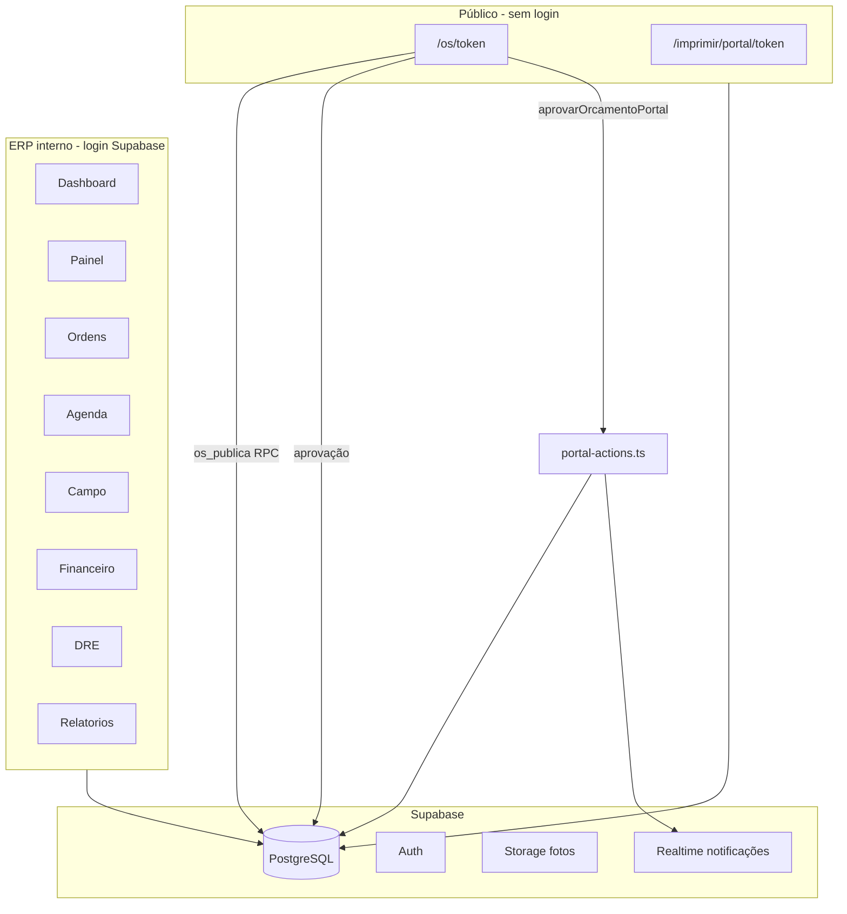
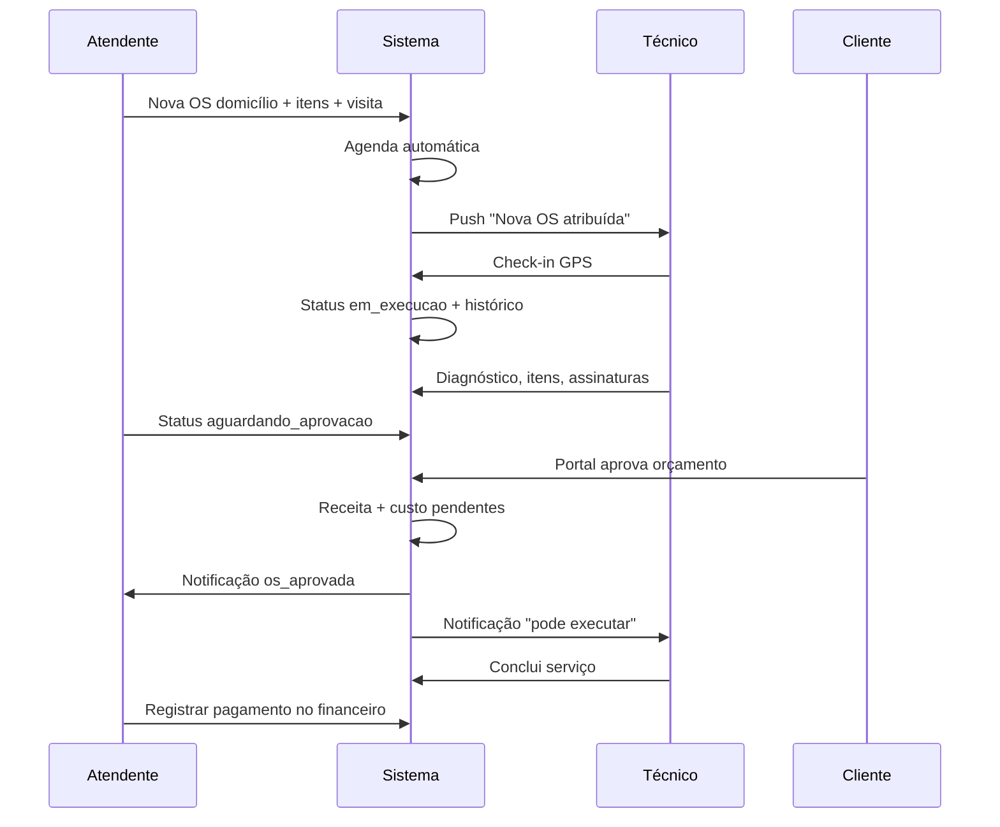

# ServitecPoa ERP — Funcionamento completo

Este documento descreve **como o sistema funciona por dentro**: módulos, fluxos, integrações, regras de negócio e métricas financeiras. Para instalação, deploy e variáveis de ambiente, consulte o [README.md](./README.md).

---

## 1. Visão geral da arquitetura

O ServitecPoa é um ERP web para assistência técnica de eletrodomésticos, com dois modos de operação:

| Modo | Descrição |
|------|-----------|
| **Domicílio** | Técnico vai até o cliente; agenda, GPS, check-in e visita são centrais. |
| **Oficina** | Equipamento fica na bancada; etiqueta QR, painel em grade e fluxo sem visita obrigatória. |



**Stack:** Next.js 14 (App Router) · TypeScript · Tailwind · Supabase · PWA com Web Push.

---

## 2. Papéis e permissões

| Papel | Foco | Home após login |
|-------|------|-----------------|
| **admin** | Acesso total | `/dashboard` |
| **atendente** | Operação + financeiro + relatórios | `/dashboard` |
| **tecnico** | Campo, OS próprias, despesas | `/campo` |

A matriz de permissões está em `src/lib/permissoes.ts`. O middleware (`src/middleware.ts`) redireciona rotas conforme o papel.

**Regras importantes:**
- Financeiro (lançar, pagar, editar) exige permissão `financeiro` (admin e atendente).
- Técnico pode criar/editar OS e fazer check-in, mas não acessa financeiro nem DRE.
- Exclusão de OS e manutenção de órfãos exigem `ordens_excluir` (admin/atendente).

---

## 3. Ciclo de vida da Ordem de Serviço (OS)

### 3.1 Status disponíveis

```
aberta → em_analise → aguardando_aprovacao → aprovada
    → em_roteiro → em_execucao → concluida → entregue

Desvios: aguardando_peca · cliente_ausente · cancelada · garantia
```

### 3.2 Criação e edição

**Arquivos:** `src/components/ordem-form.tsx` · `src/app/(app)/ordens/actions.ts`

Ao criar ou editar uma OS:

1. Cliente (existente ou novo) e equipamento são vinculados.
2. Itens (serviço/peça) definem `valor_itens` e `custo_total`.
3. Visita técnica, desconto e acréscimo entram na fórmula de total (ver seção 5).
4. **Domicílio:** técnico, data e turno obrigatórios → agenda criada/atualizada automaticamente (`src/lib/agenda-os.ts`).
5. **Oficina:** sem agenda obrigatória; após salvar, abre impressão da etiqueta QR.

**Edição com financeiro já lançado:** `sincronizarFinanceiroOs` atualiza valores de receita/custo **pendentes** quando a OS é editada.

### 3.3 Mudança de status (motor unificado)

**Arquivo:** `src/lib/transicao-os.ts`

Toda transição relevante passa por `transicionarStatusOs`, que executa em sequência:

1. Atualiza `ordens_servico` (inclui `aprovado` + `data_aprovacao` quando status = `aprovada`).
2. Insere linha em `os_status_historico`.
3. Sincroniza agenda (`sincronizarAgendaStatusOs`).
4. Se `aprovada` → cria receita e custo **pendentes** no financeiro (`criarReceitaPendenteOs`).
5. Notifica admin, atendente e técnico (`notificarMudancaStatusOs`).

**Origens da transição:**
- ERP: alteração manual de status na OS.
- Portal: RPC `os_aprovar` (aprovação do cliente).
- Campo: check-in do técnico → `em_execucao` com histórico e notificação.
- Check-out: apenas registra observação no histórico (status da OS não muda automaticamente).

### 3.4 Cliente ausente

1. Técnico assina a OS no canvas.
2. Registra ausência com foto obrigatória (`registrarClienteAusente`).
3. Status → `cliente_ausente`; notificação urgente para admin/atendente.
4. Portal exibe bloco com foto, assinatura do técnico e observação.

### 3.5 Exclusão

`excluirOrdem` chama `limparDadosVinculadosOs` (`src/lib/limpar-os.ts`): remove agendamentos, lançamentos financeiros, itens, histórico, anexos e fotos no Storage antes de apagar a OS.

---

## 4. Fluxos operacionais completos

### 4.1 Domicílio (ponta a ponta)



### 4.2 Oficina

1. OS tipo **oficina** → status inicial `em_analise`.
2. Impressão automática da **etiqueta QR** (100×50 mm).
3. Equipamento identificado via `/escanear` ou busca global.
4. Acompanhamento no **Painel** (grade 12×14 por posição).
5. Alertas de **oficina parada** quando OS fica parada em análise/peça por X dias.

### 4.3 Portal do cliente

**URL:** `/os/[token]` (token único por OS, sem login).

| Funcionalidade | Detalhe |
|----------------|---------|
| Dados da OS | Cliente, equipamento, defeito, diagnóstico, orçamento |
| Acompanhamento | `PortalAcompanhamento` — jornada visual + histórico detalhado |
| Aprovação | Assinatura opcional + RPC `os_aprovar` |
| Pós-aprovação | Receita/custo automáticos + notificações |
| QR PIX / Google | Pagamento e avaliação |
| Impressão | `/imprimir/portal/[token]` — dados completos, assinaturas, empresa |

**Dados públicos:** função SQL `os_publica` (migrations `0012`, `0015`).

---

## 5. Regras financeiras

### 5.1 Fórmula do orçamento (total do cliente)

**Arquivo:** `src/lib/os-valores.ts`

```
base = valor_itens + acréscimo - desconto

Se abater_visita = true  → total = base - valor_visita  (visita já paga, abate do serviço)
Se abater_visita = false → total = base + valor_visita  (visita cobrada no total)

total = max(0, arredondado)
```

Usada em: formulário da OS, detalhe, portal, impressão e lançamentos.

### 5.2 Integração OS → Financeiro

**Arquivo:** `src/lib/os-financeiro.ts`

| Evento | O que acontece no financeiro |
|--------|------------------------------|
| Cliente **aprova** no portal | Server action atômica `aprovarOrcamentoPortal`: receita **pendente** + custo + notificações |
| Status → **aprovada** no ERP | Idem (se ainda não houver lançamento) |
| **Lançar receita** manual na OS | Receita (pendente ou paga) + custo sempre **pendente** |
| **Editar OS** com lançamentos | Sincroniza valores dos títulos pendentes |

**Regra de negócio:** recebimento do cliente e pagamento ao fornecedor são **independentes**. Marcar receita como "paga" não marca o custo de peças como pago.

**Proteções:**
- Não permite duplicar lançamento na mesma OS (código + índice único na migration `0016`).
- OS cancelada ou com valor zero não pode ser lançada.
- `lancarFinanceiro` exige permissão `financeiro`.

### 5.3 Métricas: lucro bruto e lucro líquido

**Arquivo:** `src/lib/metricas-financeiras.ts`

| Métrica | Fórmula |
|---------|---------|
| **Receita** | Soma de lançamentos tipo receita |
| **Custo direto** | Peças e serviços (`custo_pecas`, `custo_servico`) |
| **Lucro bruto** | Receita − Custo direto |
| **Despesas operacionais** | Aluguel, salários, campo, admin, impostos, etc. |
| **Lucro líquido** | Lucro bruto − Despesas operacionais |

**Dois regimes:**

| Regime | Base | Onde aparece |
|--------|------|--------------|
| **Competência** | `valor` nominal por `data_competencia` | DRE, cards "Faturamento" no Financeiro |
| **Caixa** | `valor_pago` por `data_pagamento` | Dashboard "Recebido no mês", fluxo de caixa |

### 5.4 Pagamentos e parciais

**Arquivo:** `src/lib/financeiro.ts` · `src/app/(app)/financeiro/actions.ts`

- **Valor devido** = `valor + juros + multa`
- **Saldo em aberto** = devido − `valor_pago`
- Status: `pendente` → `parcial` → `pago` (ou `cancelado`)

### 5.5 DRE

**Rota:** `/dre` — regime de **competência**, agrupa por `grupo_dre` das categorias:

```
Receita bruta
(-) Impostos
(=) Receita líquida
(-) Custos (peças + serviços)
(=) Lucro bruto
(-) Despesas operacionais / administrativas / financeiras
(=) Resultado líquido
```

### 5.6 Despesas de campo

Técnico lança em `/campo` → entra no financeiro como despesa `origem: campo`, status `pendente`, categoria operacional. **Não** entra automaticamente no `custo_total` da OS — aparece como despesa operacional no lucro líquido.

### 5.7 Despesas recorrentes

Cadastro em `/financeiro/recorrentes`. Botão **"Gerar despesas fixas"** cria lançamentos do mês a partir das recorrentes ativas.

---

## 6. Agenda e campo

### 6.1 Agenda

- Criada/atualizada automaticamente para OS **domicílio** (`sincronizarAgendamentoOs`).
- Visualização semanal por técnico e turno (manhã/tarde).
- Status da agenda sincroniza com status da OS.

### 6.2 Check-in / Check-out

**Arquivo:** `src/app/(app)/agenda/actions.ts`

| Ação | Agenda | OS | GPS |
|------|--------|-----|-----|
| Check-in | `em_atendimento` | `em_execucao` + histórico + notificação | Salva posição |
| Check-out | `realizado` | Histórico "visita finalizada" | Atualiza posição |

### 6.3 Campo (`/campo`)

**Técnico:** visitas do dia, OS atribuídas, despesas, GPS, pull-to-refresh.

**Central (admin/atendente):** mapa com posição dos técnicos, equipe, atendimentos do dia.

---

## 7. Notificações e alertas

O sino (`src/components/notifications.tsx`) combina **duas camadas**:

### 7.1 Eventos persistidos (tabela `notificacoes`)

Gerados por `src/lib/notificacoes.ts` via `SUPABASE_SERVICE_ROLE_KEY`:

| Tipo | Quando dispara | Quem recebe |
|------|----------------|-------------|
| `os_nova` | OS atribuída ao técnico | Técnico |
| `os_aprovada` | Cliente aprova no portal | Admin, atendente **e técnico** |
| `os_status` | Mudança de status relevante | Admin, atendente, técnico da OS |
| `cliente_ausente` | Técnico registra ausência | Admin, atendente |
| `despesa_campo` | Despesa de campo lançada | Admin, atendente |

Atualização em tempo real via Supabase Realtime + polling a cada 60s.

### 7.2 Alertas operacionais (consulta ao vivo)

Calculados na hora, sem gravar no banco:

| Alerta | Condição |
|--------|----------|
| OS com visita atrasada | `data_previsao` &lt; hoje |
| Aguardando aprovação | status = `aguardando_aprovacao` |
| Aprovadas — aguardando execução | status = `aprovada` |
| Cliente ausente | status = `cliente_ausente` |
| Oficina parada | Oficina em análise/peça há X dias |
| Contas vencendo | Lançamentos com vencimento próximo |
| Meta de faturamento | Realizado &lt; 70% da meta do mês |
| Visitas hoje | Agenda do dia |

**Preferências:** `/configuracoes/alertas` — cada usuário ativa/desativa tipos, push e e-mail resumo.

**Deduplicação:** alertas operacionais de cliente ausente e despesa de campo não aparecem se já existe evento não lido do mesmo tipo.

---

## 8. Painel de atendimentos (`/painel`)

Visão operacional em tempo real:

| Metade | Visualização | Status agrupados |
|--------|--------------|------------------|
| **Domicílio** | Kanban por coluna | Análise, orçamento, roteiro, peça, ausente, garantia, concluído |
| **Oficina** | Grade 12×14 | Cores por status na posição da bancada |

Configuração em `src/lib/painel-atendimento.ts`.

---

## 9. Impressão e documentos

| Rota | Conteúdo |
|------|----------|
| `/imprimir/os/[id]` | 2 vias A4 (cliente + empresa), QR portal, PIX, assinaturas |
| `/imprimir/portal/[token]` | Via do cliente com dados completos |
| `/imprimir/etiqueta-os/[id]` | Etiqueta 100×50 mm com QR |
| `/imprimir/recibo/[id]` | Recibo de pagamento |

Componente compartilhado: `src/components/os-via-print.tsx`.

---

## 10. Módulos auxiliares

| Módulo | Rota | Função |
|--------|------|--------|
| Clientes | `/clientes` | Cadastro, equipamentos, histórico de OS |
| Catálogo | `/catalogo` | Serviços/peças pré-cadastrados para incluir na OS |
| Usuários | `/usuarios` | Papéis admin/atendente/técnico |
| Configurações | `/configuracoes` | Empresa, logo, termos, comissão, WhatsApp |
| Manutenção | `/manutencao` | Limpar agendamentos e lançamentos órfãos |
| Escanear | `/escanear` | Abrir OS pelo QR da etiqueta |

---

## 11. Banco de dados — migrations

Execute no Supabase **na ordem**. As três últimas são essenciais para as integrações recentes:

| # | Arquivo | O que adiciona |
|---|---------|----------------|
| 15 | `0015_portal_print.sql` | `os_publica` com cliente, equipamento e assinaturas completos |
| 16 | `0016_financeiro_integridade.sql` | Anti-duplicação OS, views DRE/fluxo corrigidas, `valor_pago` em quitados |
| 17 | `0017_alertas_os_status.sql` | Preferência `os_status` separada de `os_nova` |
| 18 | `0018_os_aprovar_idempotente.sql` | `os_aprovar` idempotente (sem histórico duplicado) |
| 19 | `0019_rls_financeiro_papel.sql` | RLS financeiro por papel (admin/atendente vs técnico) |

**Regras de workflow (Fase B):** matriz de transições em `transicao-status.ts`; check-out avança OS; cancelamento cancela lançamentos; OS finalizada bloqueada para edição (exceto admin).

---

## 12. Bibliotecas internas (mapa rápido)

| Arquivo | Responsabilidade |
|---------|------------------|
| `os-valores.ts` | Fórmula do total do cliente |
| `os-financeiro.ts` | Receita/custo automáticos, sync na edição |
| `metricas-financeiras.ts` | Lucro bruto, líquido, margens |
| `transicao-os.ts` | Motor de mudança de status |
| `agenda-os.ts` | OS ↔ agenda |
| `notificacoes.ts` | Eventos + push |
| `limpar-os.ts` | Exclusão em cascata |
| `permissoes.ts` | Matriz de acesso |
| `portal-visita.tsx` | Timeline do portal (`PortalAcompanhamento`) |

---

## 13. Variáveis críticas para produção

Sem estas, partes do sistema **silenciosamente não funcionam**:

| Variável | Impacto se ausente |
|----------|-------------------|
| `SUPABASE_SERVICE_ROLE_KEY` | Notificações de aprovação, push server-side |
| `0014_notificacoes.sql` | Tabelas de notificações e preferências |
| `0015`–`0017` | Portal completo, financeiro integrado, alertas de status |
| VAPID keys | Push no celular |
| `NEXT_PUBLIC_SITE_URL` | QR codes, links do portal e etiquetas |

---

## 14. Resumo executivo

O ServitecPoa conecta **operação** (OS, agenda, campo), **cliente** (portal, aprovação, timeline) e **financeiro** (receita, custo, lucro) em um fluxo contínuo:

1. **Abre a OS** → calcula orçamento, cria agenda (domicílio).
2. **Cliente aprova** → financeiro nasce automaticamente (receita + custo pendentes).
3. **Técnico executa** → check-in, assinaturas, fotos, status.
4. **Pagamento** → registrado no financeiro (total ou parcial).
5. **Gestão** → dashboard, DRE e relatórios mostram lucro bruto e líquido em competência e caixa.

O sistema foi desenhado para assistência técnica real: visita abatida, custo de peça separado do recebimento, técnico no celular e cliente acompanhando pelo portal sem precisar ligar na loja.

---

*Documento gerado para o repositório ServitecPoa ERP. Última revisão alinhada às migrations 0015–0017 e integrações de financeiro/alertas/portal.*
